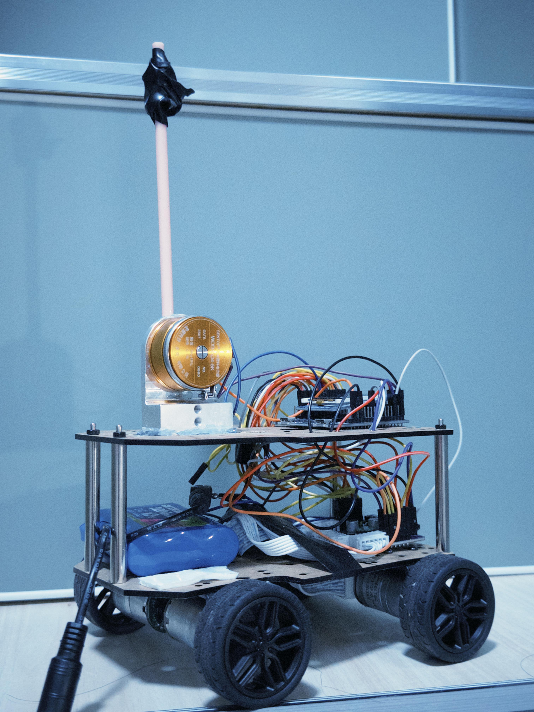
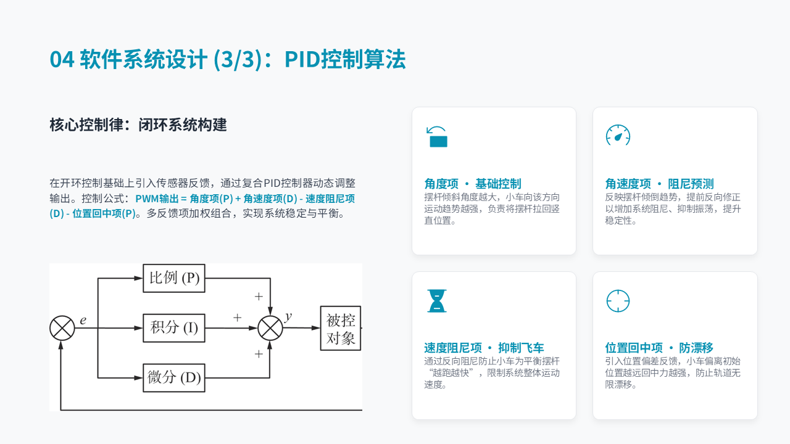
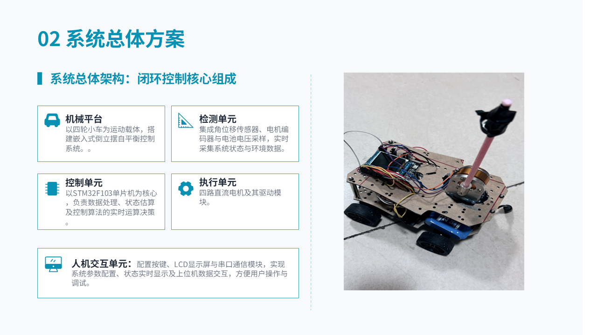
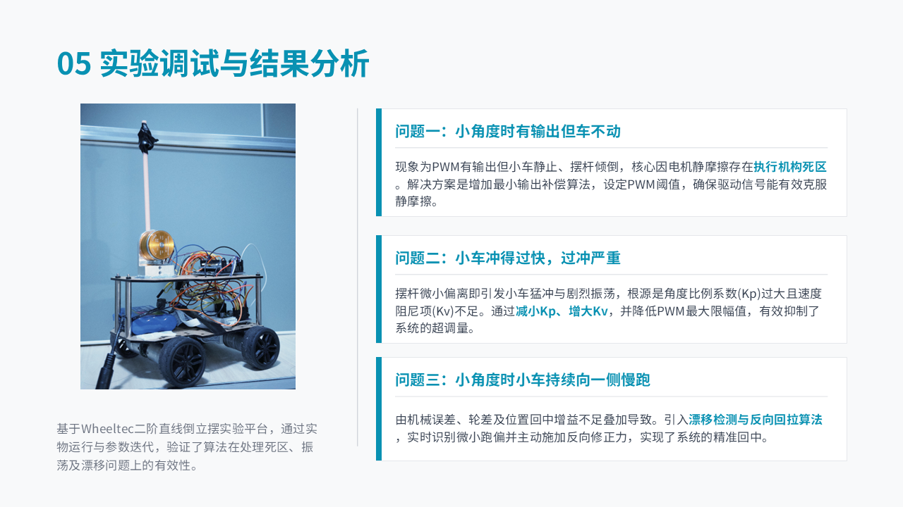

# STM32 Inverted Pendulum Cart



[中文](./README.zh-CN.md) · [Demo video](./media/demonstration.mp4) · [Presentation](./presentation/project-presentation.pptx) · [Course report](./控制工程原理课程设计报告.md)

[](https://www.st.com/en/microcontrollers-microprocessors/stm32f103rc.html)
[](#control-strategy)
[](https://www.iso.org/standard/82075.html)
[](https://www.keil.com/)
[](#runtime-logic)
[](./LICENSE-CONTENT.md)

A course-design prototype that uses an STM32F103RCT6, a WHEELTEC D24A four-wheel encoder chassis, and a WDD35D4 angular displacement sensor to investigate real-time inverted-pendulum stabilization. The photograph above is the completed physical prototype extracted from the final presentation.

## Project at a glance

| Item | Details |
|---|---|
| Project period | **June 2026** |
| Course | Control Engineering Principles — course design |
| Project lead | **Hu Rongjie (胡荣杰 / WuWingKit)** |
| Team | tulip627722, hzx, Lisa-TTT, zzz-rh |
| Platform | STM32F103RCT6 + D24A chassis + WDD35D4 angle sensor |
| Control mode | Manual upright placement; forward/backward balance only |
| Prototype cost | **Not recorded in the supplied materials — to be added** |

### Team contributions

- **Hu Rongjie — project lead/owner:** overall architecture, system integration, controller iteration, debugging, repository and final archive.
- **tulip627722:** motor control, PID tuning, and encoder driver.
- **hzx:** hardware pin mapping and documentation.
- **Lisa-TTT, zzz-rh:** gyroscope/angular-velocity sensor exploration.

The final archived controller uses the WDD35D4 angular displacement sensor and discrete angle-rate estimation. Team credits above preserve the roles recorded by the original repository.

## Commercialization and application analysis

An inverted-pendulum cart is primarily an education and control-algorithm validation platform. Its commercial value lies in laboratory teaching kits, controller-tuning demonstrations, embedded real-time training, and rapid comparison of PID, state-feedback, LQR, or observer-based methods. The same balance principles also transfer to self-balancing robots and unstable-platform control.

A productized teaching kit would benefit from a rigid modular frame, guarded moving parts, repeatable sensor mounting, guided tuning software, automatic experiment logging, replaceable components, and a documented safety envelope. The present prototype is a course-stage experimental platform and should not be presented as a transportation product or unattended balancing system.

## Control strategy

The controller combines several feedback terms:

```text
angle feedback + angular-rate damping
             - speed damping
             - position centering
             + nonlinear rescue / minimum-output compensation
             → four-wheel PWM
```

- Angle error is the dominant balancing term.
- A discrete derivative estimates angular rate and reacts to the falling direction.
- Encoder feedback damps cart speed and integrates position to reduce long-term drift.
- Minimum-output compensation helps overcome motor static friction.
- Rescue boost and drift pull-back assist recovery outside the small-angle region.
- Output is disabled when the safety-angle threshold is exceeded.



## Runtime logic

1. Initialize the LCD, keys, ADC, PWM, encoders, and timers.
2. Manually hold the pendulum close to upright.
3. Press `KEY2` to capture the WDD35D4 zero reference and enable balance control.
4. Every `2 ms` (`500 Hz`), TIM1 samples the angle, reads four encoders, updates angle rate/speed/position, computes the controller, and writes motor PWM.
5. `KEY3`, serial stop, or excessive angle disables the motors.

The project **does not implement automatic swing-up**. A presentation draft briefly described motion from hanging to upright, but the final firmware and demonstrated workflow require manual upright placement.

## Hardware and software architecture



```text
WDD35D4 angle sensor ── ADC ─┐
Four wheel encoders ─ timers ├─→ TIM1 control ISR, every 2 ms
                              │      ├─ angle and angular-rate estimate
Keys / serial commands ───────┘      ├─ speed and position feedback
                                     ├─ Balance_Update()
                                     └─ safety and output limiting
                                                ↓
                                      PWM + direction drivers
                                                ↓
                                         four DC motors

Main foreground loop → keys, commands, LCD refresh, serial diagnostics
TIM6 ISR at 50 kHz   → software quadrature decode for encoder D
```

### Firmware layers

| Layer | Main paths | Responsibility |
|---|---|---|
| Application | `USER/main.c`, `USER/key.c` | Startup, zero/start/stop commands, LCD updates, serial diagnostics, and TIM1 control interrupt |
| Controller | `HAREWER/BALANCE/` | Angle-rate estimation, speed filtering, position integration, rescue logic, drift correction, dead-zone compensation, and output limiting |
| Feedback | `HAREWER/ADC/`, `ENCODER/`, `FILTER/` | Angle/battery ADC, four encoder channels, and signal filtering |
| Actuation | `HAREWER/PWM/`, `MOTO/`, `GPIO/` | Four PWM channels and motor direction control |
| Interface | `HAREWER/LCD/`, `SYSTEM/usart/` | Local status display and 115200 bps diagnostics |
| Platform | `CORE/`, `STM32F10x_FWLIB/`, `SYSTEM/` | CMSIS, startup, Standard Peripheral Library, clock, and delays |

The directory name `HAREWER` is a historical spelling retained to avoid breaking the existing Keil project paths.

## Hardware and important interfaces

| Function | Implementation |
|---|---|
| MCU | STM32F103RCT6, 72 MHz |
| Chassis | WHEELTEC D24A four-wheel chassis with Hall encoders |
| Angle sensor | WDD35D4 on `PC4 / ADC1_CH14` |
| Motor PWM | TIM5 CH1–CH4 on `PA0–PA3`, 10 kHz |
| Encoder A/B/C | TIM8 / TIM2 / TIM3 hardware quadrature |
| Encoder D | Software decoding in TIM6 ISR at 50 kHz |
| Local UI | 1.44-inch 128×128 SPI LCD and keys |
| Debug | USART1, 115200 bps |

## Development progression

- Replaced a slow 50 ms software-polling path for encoder D with a 50 kHz TIM6 interrupt decoder.
- Added 50-sample zero calibration for the WDD35D4 sensor.
- Consolidated the final balance computation into a deterministic 2 ms TIM1 loop.
- Added motor dead-zone compensation after observing PWM output without physical motion.
- Reduced overshoot through gain/limit tuning and added drift detection with reverse pull-back.



## Download, build, and test

### 1. Download the source

```bash
git clone https://github.com/WuWingKit/Inverted-pendulum.git
cd Inverted-pendulum
```

Without Git, choose **Code → Download ZIP** on GitHub and extract the archive.

### 2. Build and flash

1. Install Keil MDK 5 with ARM Compiler 5 and an ST-Link or J-Link driver.
2. Open `USER/Tb6612demo.uvprojx`.
3. Build the existing target with `F7` and resolve all errors before connecting the motors.
4. Connect the programmer through SWD and download with `F8`.
5. Confirm `BOOT0` is low and the LCD debug page appears after reset.

### 3. First controlled test

1. Raise the chassis so the wheels can rotate freely and verify motor direction and all four encoder signs.
2. Check the WDD35D4 raw ADC value and confirm that tilting the rod changes angle in the expected direction.
3. Put the cart on a clear floor, hold the pendulum near upright, and press `KEY2` to capture zero and start.
4. Apply only a small disturbance. Press `KEY3` immediately if the motors drive in the wrong direction or the cart accelerates away.
5. Inspect the serial fields before changing gains: `Ang`, `Rate`, `SF`, `Pos`, `Bias`, and `PWM`.

Serial commands: `z`/`Z` zeroes and starts; `s`/`S` stops. Debug output includes angle, rate, filtered speed, position, bias, ADC, and PWM.

## Repository contents

- `USER/Tb6612demo.uvprojx`: Keil MDK project entry point
- `HAREWER/BALANCE/`: final balance controller
- `HAREWER/ENCODER/`, `MOTO/`, `PWM/`: motion feedback and actuation
- `USER/main.c`: initialization, UI, commands, and 2 ms control ISR
- `DEVLOG.md`: development history
- `控制工程原理课程设计报告.md` and `倒立摆小车开发文档.pdf`: technical documentation
- `presentation/project-presentation.pptx`: final course presentation
- `media/demonstration.mp4`: physical prototype demonstration
- `assets/`: README images exported from the presentation

## Current limitations

- Manual upright placement is required; there is no automatic swing-up.
- The cart only controls forward/backward motion and does not steer.
- Small-angle recentering and long-duration drift rejection still require improvement.
- The controller is empirically tuned; no complete plant identification or formal stability proof is included.
- Keep the test area clear: the cart can accelerate unexpectedly during recovery.

## License

Project-authored documentation, presentation, images, video, and hardware-design material are shared under **CC BY-NC-SA 4.0**; see [LICENSE-CONTENT.md](./LICENSE-CONTENT.md). Source and third-party vendor components retain the terms stated in their respective files.
